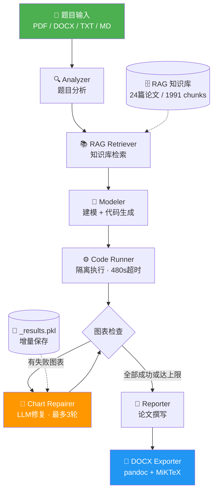

<div align="center">

# 🧮 数学建模 Agent（Math Modeling Agent）

**端到端自动化数学建模竞赛解题系统：从题目输入到论文输出，全链路 AI 驱动**

[](https://python.org)
[](https://streamlit.io)
[](https://deepseek.com)
[](LICENSE)

</div>

## 项目简介

面向全国大学生数学建模竞赛（CUMCM）的 AI Agent 系统，输入题目原文和数据附件，自动完成分析→检索→建模→求解→论文撰写→Word导出的完整流程。

## 效果展示

> 📸 截图待补充：将 Streamlit 界面截图、公式渲染效果、图表输出示例放入 `docs/images/` 目录后在此引用。

## 系统架构



## 核心特性

- **全链路 Pipeline**：Analyzer → Retriever → Modeler → Code Runner → Reporter → DOCX Exporter，六阶段自动化
- **RAG 知识库**：24篇华为杯优秀论文 / 1991 chunks，BGE-small-zh-v1.5 embedding + ChromaDB 向量检索
- **图表自动修复循环**：求解代码执行后，成功的图保留，失败的图收集 traceback 发给 LLM 修复，最多重试3轮，修复代码从 `_results.pkl` 加载结果只画图不重新求解
- **MILP 建模防护**：prompt 层面禁止逐个体二进制变量（防止变量爆炸），要求聚合整数变量建模，变量规模控制在 5000 以内
- **代码执行安全**：subprocess 隔离 + 480秒超时 + autopep8 自动格式化 + Agg 后端防阻塞
- **LaTeX 公式修复**：docx_exporter 内置 5 种下划线损坏模式的自动修复，pandoc 转换为 Word 原生可编辑公式
- **表格排版修复**：docx 后处理自动设置 cantSplit + keepNext，防止表格跨页断裂
- **增量结果保存**：每个子问题求解后立即序列化到 `_results.pkl`，超时不丢失已有结果
- **多格式题目输入**：支持 PDF / DOCX / TXT / Markdown 上传，自动提取文本
- **Streamlit Web UI**：实时进度显示、图表预览、论文下载、历史项目管理

## 技术栈

| 组件 | 技术选型 |
|------|---------|
| LLM | DeepSeek V4 Pro（分析/建模/论文/修复） |
| 向量库 | ChromaDB + BGE-small-zh-v1.5 |
| 求解器 | PuLP (CBC) / OR-Tools (CP-SAT) / SciPy |
| 文档转换 | pandoc 3.10 + MiKTeX 25.12 |
| 代码格式化 | autopep8 |
| 前端 | Streamlit |
| PDF 解析 | PyMuPDF |

## 项目结构

```
math-modeling-agent/
├── agents/
│   ├── analyzer.py          # 题目分析 Agent
│   ├── modeler.py           # 建模 Agent（含 MILP 防护规则）
│   ├── reporter.py          # 论文撰写 Agent（含 LaTeX 公式规范）
│   └── chart_repairer.py    # 图表修复 Agent
├── rag/
│   ├── retriever.py         # 向量检索 + 方法提取
│   ├── chunker.py           # 论文切片
│   ├── indexer.py           # 向量入库
│   ├── annotator.py         # 片段标注
│   └── store.py             # ChromaDB 存储
├── tools/
│   ├── code_runner.py       # 代码隔离执行 + 图表状态解析
│   ├── docx_exporter.py     # Markdown → Word（含公式修复 + 表格修复）
│   └── chart_generator.py   # 图表工具
├── templates/
│   └── cumcm_template.md    # 国赛论文模板
├── knowledge/
│   ├── papers/              # 原始 PDF
│   ├── processed/           # 切片中间产物
│   └── chroma_db/           # 向量库持久化
├── app.py                   # Streamlit 主入口
├── app_helpers.py           # Pipeline 分阶段执行 + 修复循环
├── config.py                # 配置管理
├── main.py                  # CLI 入口
└── requirements.txt         # 依赖
```

## 快速开始

### 1. 环境准备

```bash
git clone https://github.com/jike6991-source/math-modeling-agent.git
cd math-modeling-agent
pip install -r requirements.txt

# Word 导出需要 pandoc 和 MiKTeX
# Windows: winget install pandoc MiKTeX
# macOS: brew install pandoc mactex
```

### 2. 配置

```bash
# 项目根目录创建 .env
echo "DEEPSEEK_API_KEY=your_api_key_here" > .env
```

### 3. 启动

```bash
streamlit run app.py
```

## 已知局限与后续计划

- [ ] RAG 知识库扩充：加入国赛（CUMCM）历年论文，覆盖排班/路径/多目标等题型
- [ ] 混合检索：BM25 + 向量 + RRF 融合 + Cross-Encoder 精排
- [ ] 建模技巧知识库：按题型整理建模范式/反模式文档，作为 RAG 专门分区
- [ ] Analyzer 规模预估：识别优化类题目后估算变量规模，注入建模约束
- [ ] 代码自修复循环：求解代码本身的 bug 修复（当前仅修复图表）

## 开发者

黄杰 — 齐齐哈尔大学 信息与计算科学 2024级

GitHub: [jike6991-source](https://github.com/jike6991-source)
