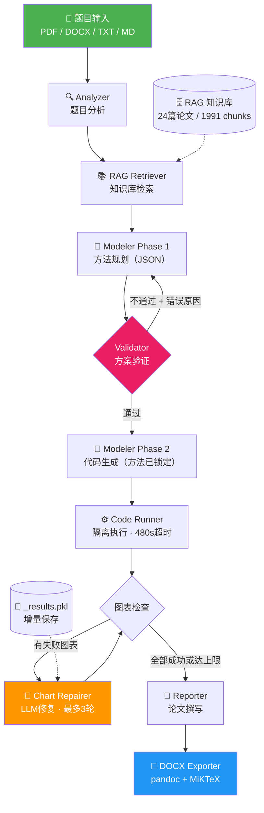
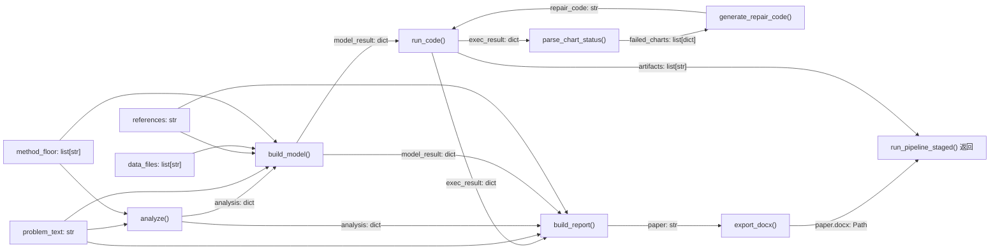

<div align="center">

# 🧮 数学建模 Agent（Math Modeling Agent）

**端到端自动化数学建模竞赛解题系统：从题目输入到论文输出，全链路 AI 驱动**

[](https://python.org)
[](https://streamlit.io)
[](https://deepseek.com)
[](LICENSE)

</div>

## 项目简介

面向全国大学生数学建模竞赛（CUMCM）的 AI Agent 系统，输入题目原文和数据附件，自动完成分析→检索→建模→求解→论文撰写→Word导出的完整流程。

## 效果展示

> 📸 截图待补充：将 Streamlit 界面截图、公式渲染效果、图表输出示例放入 `docs/images/` 目录后在此引用。

## 系统架构



## 核心特性

- **两阶段建模**：第一阶段 LLM 规划求解方案（输出 JSON），Validator 代码层面验证方案合理性（不通过则带错误原因重试），第二阶段锁定方案后生成求解代码，从根本上避免 LLM 选错求解器或变量设计
- **全链路 Pipeline**：Analyzer → Retriever → Modeler(×2) → Code Runner → Reporter → DOCX Exporter，六阶段自动化
- **RAG 知识库**：24篇华为杯优秀论文 / 1991 chunks，BGE-small-zh-v1.5 embedding + ChromaDB 向量检索
- **图表自动修复循环**：求解代码执行后，成功的图保留，失败的图收集 traceback 发给 LLM 修复，最多重试3轮，修复代码从 `_results.pkl` 加载结果只画图不重新求解
- **MILP 建模防护**：prompt 层面禁止逐个体二进制变量（防止变量爆炸），要求聚合整数变量建模，变量规模控制在 5000 以内
- **代码执行安全**：subprocess 隔离 + 480秒超时 + autopep8 自动格式化 + Agg 后端防阻塞
- **LaTeX 公式修复**：docx_exporter 内置 5 种下划线损坏模式的自动修复，pandoc 转换为 Word 原生可编辑公式
- **表格排版修复**：docx 后处理自动设置 cantSplit + keepNext，防止表格跨页断裂
- **增量结果保存**：每个子问题求解后立即序列化到 `_results.pkl`，超时不丢失已有结果
- **多格式题目输入**：支持 PDF / DOCX / TXT / Markdown 上传，自动提取文本
- **Streamlit Web UI**：实时进度显示、图表预览、论文下载、历史项目管理

## 技术栈

| 组件 | 技术选型 |
|------|---------|
| LLM | DeepSeek V4 Pro（分析/建模/论文/修复） |
| 向量库 | ChromaDB + BGE-small-zh-v1.5 |
| 求解器 | PuLP (CBC) / OR-Tools (CP-SAT) / SciPy |
| 文档转换 | pandoc 3.10 + MiKTeX 25.12 |
| 代码格式化 | autopep8 |
| 前端 | Streamlit |
| PDF 解析 | PyMuPDF |

## 项目结构

```
math-modeling-agent/
├── agents/
│   ├── analyzer.py          # 题目分析 Agent
│   ├── modeler.py           # 建模 Agent（含 MILP 防护规则）
│   ├── reporter.py          # 论文撰写 Agent（含 LaTeX 公式规范）
│   └── chart_repairer.py    # 图表修复 Agent
├── rag/
│   ├── retriever.py         # 向量检索 + 方法提取
│   ├── chunker.py           # 论文切片
│   ├── indexer.py           # 向量入库
│   ├── annotator.py         # 片段标注
│   └── store.py             # ChromaDB 存储
├── tools/
│   ├── code_runner.py       # 代码隔离执行 + 图表状态解析
│   ├── docx_exporter.py     # Markdown → Word（含公式修复 + 表格修复）
│   └── chart_generator.py   # 图表工具
├── templates/
│   └── cumcm_template.md    # 国赛论文模板
├── knowledge/
│   ├── papers/              # 原始 PDF
│   ├── processed/           # 切片中间产物
│   └── chroma_db/           # 向量库持久化
├── app.py                   # Streamlit 主入口
├── app_helpers.py           # Pipeline 分阶段执行 + 修复循环
├── config.py                # 配置管理
├── main.py                  # CLI 入口
└── requirements.txt         # 依赖
```

## 技术细节

### 各阶段数据流向图



### 阶段 1 — RAG 检索输出

由 `rag.retriever` 提供，传入后续阶段：

| 变量 | 类型 | 说明 |
|------|------|------|
| `references` | `str` | 格式化后的优秀论文片段，作为建模与论文撰写参考 |
| `method_floor` | `list[str]` | 参考论文使用的方法名列表，作为 Analyzer 和 Modeler 的方法下限 |

检索时取题目前 500 字，`top_k=6`；结果同步保存到 `projects/<name>/references.md`。

---

### 阶段 2 — Analyzer 输出（`analysis: dict`）

由 `agents/analyzer.py` 的 `analyze()` 返回，保存为 `analysis.json`。

```json
{
  "problem_type": "优化",
  "key_variables": ["变量1", "变量2"],
  "suggested_methods": ["建模方向1", "建模方向2"],
  "recommended_methods": [
    {"method": "集合覆盖模型", "reason": "题目为覆盖类调度，决策变量为班次选择"},
    {"method": "整数线性规划", "reason": "存在明确的最小化成本目标函数和线性约束"}
  ],
  "recommended_libraries": ["pulp", "numpy", "pandas"]
}
```

| 字段 | 类型 | 说明 |
|------|------|------|
| `problem_type` | `str` | 必须为 `"优化"` `"预测"` `"评价"` `"分类"` 之一 |
| `key_variables` | `list[str]` | LLM 识别的关键决策/状态变量名称 |
| `suggested_methods` | `list[str]` | 概括性建模方向（高层次） |
| `recommended_methods` | `list[dict]` | 每项含 `method`（具体方法名）和 `reason`（针对本题的适用理由） |
| `recommended_libraries` | `list[str]` | 推荐使用的 Python 库名 |

---

### 阶段 3 — Modeler 输出（`model_result: dict`）

由 `agents/modeler.py` 的 `build_model()` 返回，两阶段生成。

```json
{
  "model_description": "## 模型假设\n...\n## 目标函数\n$$...$$",
  "solver_code": "import pulp\n...",
  "expected_outputs": ["排班方案表", "成本对比图", "敏感性分析图"],
  "plan": {
    "solver": "pulp",
    "variable_design": "aggregate_integer",
    "sub_problems": ["问题1：最小化总成本", "问题2：灵敏度分析"],
    "estimated_total_vars": 480,
    "approach_summary": "聚合整数规划，按时段统计各班次人数"
  }
}
```

| 字段 | 类型 | 说明 |
|------|------|------|
| `model_description` | `str` | Markdown 格式数学模型（假设、符号、目标函数、约束） |
| `solver_code` | `str` | 可独立运行的完整 Python 求解代码，保存为 `solver.py` |
| `expected_outputs` | `list[str]` | LLM 预期的产出说明，每项一条 |
| `plan.solver` | `str` | 第一阶段确认的求解器：`pulp` `scipy` `statsmodels` `sklearn` `networkx` `cpsat` |
| `plan.variable_design` | `str` | 变量设计策略：`aggregate_integer` `continuous` `not_applicable` |
| `plan.sub_problems` | `list[str]` | 各子问题简述 |
| `plan.estimated_total_vars` | `int` | 预估决策变量总数（Validator 校验上限 10000） |
| `plan.approach_summary` | `str` | 整体求解思路一句话描述 |

`model_description` 保存为 `model.md`，`solver_code` 保存为 `solver.py`。

---

### 阶段 4 — Code Runner 输出（`exec_result: dict`）

由 `tools/code_runner.py` 的 `run_code()` 返回，工作目录为 `projects/<name>/charts/`。

```json
{
  "success": true,
  "returncode": 0,
  "stdout": "[CHART_OK:图1_需求热力图.png]\n[CHART_OK:图2_排班方案.png]",
  "stderr": "",
  "timeout": false,
  "artifacts": [
    "D:/.../<name>/charts/图1_需求热力图.png",
    "D:/.../<name>/charts/图2_排班方案.png",
    "D:/.../<name>/charts/_results.pkl"
  ]
}
```

| 字段 | 类型 | 说明 |
|------|------|------|
| `success` | `bool` | `returncode == 0` 且未超时 |
| `returncode` | `int \| None` | 子进程退出码；超时时为 `None` |
| `stdout` | `str` | 标准输出，含 `[CHART_OK:…]` / `[CHART_FAIL:…]` 标记 |
| `stderr` | `str` | 错误输出；超时时包含超时说明 |
| `timeout` | `bool` | 是否因超时被 kill（阈值 480 秒） |
| `artifacts` | `list[str]` | 执行后工作目录新增文件的**绝对路径**列表（PNG + pkl 等） |

`parse_chart_status(stdout, workdir)` 进一步解析图表标记，返回：

```json
{
  "succeeded": ["图1_需求热力图.png"],
  "failed": [
    {"name": "图3_灵敏度分析.png", "traceback": "Traceback...\nKeyError: 'cost'"}
  ]
}
```

---

### 阶段 4.5 — Chart Repairer 输入输出

`agents/chart_repairer.py` 的 `generate_repair_code()` 接收：

| 参数 | 类型 | 说明 |
|------|------|------|
| `original_code` | `str` | 原始完整求解代码（供 LLM 理解变量上下文） |
| `failed_charts` | `list[dict]` | 每项含 `name`（文件名）和 `traceback`（完整错误栈） |

返回 `str`（可独立运行的 Python 修复代码），修复代码通过 `pickle.load("_results.pkl")` 获取求解结果，不重新求解，最多循环 3 轮。

---

### 阶段 5 — Reporter 输入输出

`agents/reporter.py` 的 `build_report()` 接收 `problem_text`、`analysis`、`model_result`、`exec_result`（`artifacts` 转为相对路径后传入）、`references`，返回 `str`（Markdown 论文全文），保存为 `paper.md`。

---

### run_pipeline_staged 最终返回

```python
{
    "project_dir":      Path,        # projects/<name>/
    "paper_path":       Path,        # projects/<name>/paper.md
    "paper_docx_path":  Path | None, # projects/<name>/paper.docx（导出失败时为 None）
    "solver_path":      Path,        # projects/<name>/solver.py
    "artifacts":        list[str],   # 图表相对路径列表（相对于 project_dir）
    "exec_success":     bool,        # exec_result["success"]
}
```

---

### 项目目录产物一览

每道题完成后 `projects/<name>/` 的产物结构：

```
projects/<name>/
├── problem.md          # 题目原文
├── analysis.json       # Analyzer 输出
├── references.md       # RAG 检索到的参考片段
├── model.md            # Modeler 数学模型描述
├── solver.py           # Modeler 生成的求解代码
├── paper.md            # Reporter 输出的 Markdown 论文
├── paper.docx          # pandoc 导出的 Word 论文
├── data/               # 上传的数据附件（CSV/Excel）
└── charts/             # Code Runner 工作目录
    ├── 图1_xxx.png
    ├── 图2_xxx.png
    └── _results.pkl    # 求解结果序列化，供图表修复代码加载
```

---

## 快速开始

### 1. 环境准备

```bash
git clone https://github.com/jike6991-source/math-modeling-agent.git
cd math-modeling-agent
pip install -r requirements.txt

# Word 导出需要 pandoc 和 MiKTeX
# Windows: winget install pandoc MiKTeX
# macOS: brew install pandoc mactex
```

### 2. 配置

```bash
# 项目根目录创建 .env
echo "DEEPSEEK_API_KEY=your_api_key_here" > .env
```

### 3. 启动

```bash
streamlit run app.py
```

## 已知局限与后续计划

- [ ] RAG 知识库扩充：加入国赛（CUMCM）历年论文，覆盖排班/路径/多目标等题型
- [ ] 混合检索：BM25 + 向量 + RRF 融合 + Cross-Encoder 精排
- [ ] 建模技巧知识库：按题型整理建模范式/反模式文档，作为 RAG 专门分区
- [ ] Analyzer 规模预估：识别优化类题目后估算变量规模，注入建模约束
- [ ] 代码自修复循环：求解代码本身的 bug 修复（当前仅修复图表）

## 开发者

黄杰 — 齐齐哈尔大学 信息与计算科学 2024级

GitHub: [jike6991-source](https://github.com/jike6991-source)
