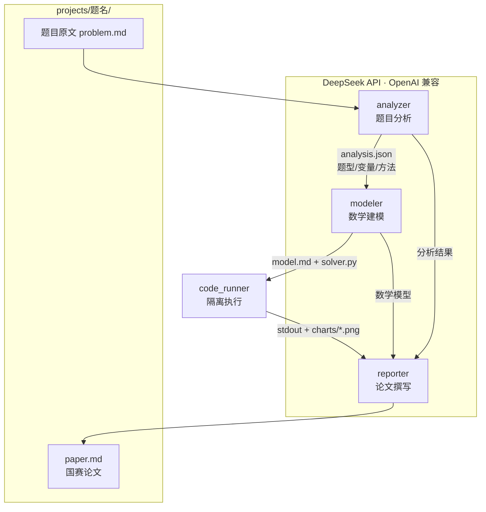

# Math Modeling Agent / 数学建模自动化 Agent

> 输入一道数学建模题目，自动产出完整建模分析报告（数学模型、可运行代码、图表、国赛论文）。
> Targeting CUMCM (China Undergraduate Mathematical Contest in Modeling).

---

## English Summary

**Math Modeling Agent** is an automated pipeline for mathematical modeling competitions
(CUMCM). Given a problem statement, it runs a multi-agent workflow — **analyze → model →
execute → write** — and outputs a complete paper with mathematical models, runnable Python
code, generated charts, and a CUMCM-style report.

- **LLM**: DeepSeek (via the OpenAI-compatible SDK, easy to swap models)
- **Agents**: `analyzer` (problem typing & variable extraction) → `modeler` (math model +
  solver code) → `reporter` (paper writing)
- **Tools**: sandboxed code execution (`subprocess`, configurable timeout) + matplotlib charts
- **Output**: each problem gets its own folder under `projects/` holding all artifacts

See the Chinese sections below for full documentation.

---

## 项目简介

数学建模自动化 Agent：输入建模题目，自动完成 **题目分析 → 数学建模 → 代码执行 → 论文撰写**
全流程，输出含数学模型、可运行求解代码、图表与国赛风格论文的完整报告。目标比赛为
**全国大学生数学建模竞赛（CUMCM）**。

## 功能特性

- 🧠 **题目智能分析**：自动识别题型（优化/预测/评价/分类）、提取关键变量、推荐建模方法
- 📐 **自动建模**：生成数学模型（假设、符号、目标函数、约束）与自包含的 Python 求解代码
- ▶️ **安全代码执行**：`subprocess` 隔离运行生成代码，超时可配置（默认 180 秒），自动捕获输出与图表
- 📊 **图表生成**：matplotlib 出图，内置中文字体（SimHei）配置
- 📄 **论文撰写**：按国赛模板生成结构化论文，结合数值结论与图表
- 🗂 **按题归档**：每道题在 `projects/<题名>/` 下独立存放全部产物
- 🔌 **模型可替换**：基于 OpenAI 兼容接口，便于切换其他 LLM

## 技术架构



- **编排层**：`main.py` 串联各 Agent，按字典传递中间结果
- **Agent 层**：`agents/analyzer.py`、`agents/modeler.py`、`agents/reporter.py`
- **工具层**：`tools/code_runner.py`（代码执行）、`tools/chart_generator.py`（图表，规划中）
- **配置层**：`config.py` 统一加载 `.env` 与路径/超时常量，提供 `get_llm_client()`

## 快速开始

### 1. 安装依赖

```bash
pip install -r requirements.txt
```

### 2. 配置 `.env`

在项目根目录创建 `.env`（不会提交 git）：

```ini
DEEPSEEK_API_KEY=sk-your-key-here
# 以下为可选，均有默认值
DEEPSEEK_BASE_URL=https://api.deepseek.com
DEEPSEEK_MODEL=deepseek-chat
```

### 3. 运行示例

将题目写入一个文本文件（如 `problem.txt`），然后运行：

```bash
python main.py 2023A_定日镜 problem.txt
# 可选：自定义代码执行超时（秒）
python main.py 2023A_定日镜 problem.txt --timeout 240
```

运行完成后，产物位于 `projects/2023A_定日镜/`：

```
projects/2023A_定日镜/
├── problem.md      # 题目原文
├── analysis.json   # 题目分析结果
├── model.md        # 数学模型描述
├── solver.py       # 求解代码
├── charts/         # 图表 PNG（git 忽略，可重新生成）
└── paper.md        # 最终论文
```

> 仓库内 `projects/demo_生产线优化/` 是一个端到端示例，可直接参考。

## 项目结构

```
math-modeling-agent/
├── CLAUDE.md              # 项目约定与设计说明
├── README.md             # 本文件
├── .env                  # API 密钥（不提交 git）
├── requirements.txt
├── config.py             # 配置加载 + get_llm_client()
├── main.py               # 入口，pipeline 编排
├── agents/
│   ├── analyzer.py       # 题目分析：识别题型、提取变量、推荐方法
│   ├── modeler.py        # 建模：生成数学模型与求解代码
│   └── reporter.py       # 报告：按模板撰写国赛论文
├── tools/
│   ├── code_runner.py    # subprocess 隔离执行代码，超时/产物捕获
│   └── chart_generator.py# matplotlib 图表工具（规划中）
├── rag/                  # Phase 2：论文检索（规划中）
│   ├── indexer.py
│   └── retriever.py
├── templates/
│   └── cumcm_template.md # 国赛论文 Markdown 模板
├── projects/             # 每题一子目录存放产物（图表忽略）
├── outputs/              # 临时产物（不提交 git）
└── tests/
    └── test_pipeline.py  # 端到端测试
```

## 开发计划

- ✅ **Phase 1（已完成）**：最小 pipeline 跑通 —— 题目分析 → 建模代码 → 图表 → 国赛论文，
  产物按题归档。
- 🔜 **Phase 2：RAG 论文检索**
  - 用 ChromaDB + BGE-small-zh-v1.5 对历年优秀论文切片入库（`rag/indexer.py`）
  - 建模时检索相似论文片段（`rag/retriever.py`），为 modeler/reporter 提供参考增强
  - 引入执行失败/超时的反馈重试环，将报错回灌给 modeler 自动修正代码
- 🔮 **Phase 3：多 LLM 协作**
  - 不同 Agent 使用不同模型（如建模用强推理模型、撰写用长文本模型）
  - 多模型对同一题给出多套方案，交叉评审择优
  - 评审 Agent：对生成的模型与论文做质量打分与改进建议

## 技术栈

- Python 3.11+
- DeepSeek API（OpenAI 兼容 SDK）
- matplotlib（中文字体 SimHei）
- python-docx / LaTeX（论文输出，Phase 2）
- ChromaDB + BGE embeddings（RAG，Phase 2）

## 约定

详见 [CLAUDE.md](CLAUDE.md)：代码规范（中文 docstring、类型注解、logging、API 重试）、
设计决策与目录约定。

---

*本项目用于学习与竞赛辅助，生成内容需人工复核后使用。*
